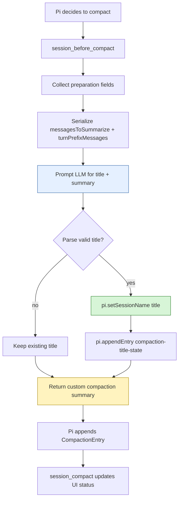
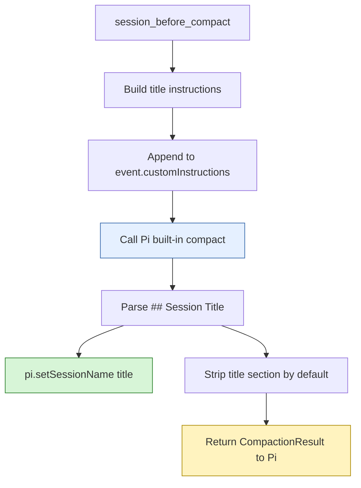

# Pi compaction-title extension: analysis, design, and implementation guide

## 1. Executive answer: is this possible?

Yes. It is possible to build a Pi extension that asks the compaction process to create or update a proper title for the current session and stores that title in the session.

The cleanest implementation is a **custom compaction extension** that intercepts `session_before_compact`, asks an LLM to produce both:

1. a normal compaction summary, and
2. a short session title,

then stores the title with Pi's `pi.setSessionName(title)` API and returns the custom compaction summary to Pi.

This is possible because Pi exposes all required building blocks:

| Capability needed | Pi API / file | Available? |
|---|---|---|
| Detect compaction before it happens | `pi.on("session_before_compact", ...)` | Yes |
| Access messages being summarized | `event.preparation.messagesToSummarize`, `turnPrefixMessages`, `previousSummary` | Yes |
| Replace default compaction summary | return `{ compaction: { summary, firstKeptEntryId, tokensBefore } }` | Yes |
| Call a model from the extension | `complete()` from `@mariozechner/pi-ai` plus `ctx.modelRegistry.getApiKeyAndHeaders()` | Yes |
| Store a human-readable session title | `pi.setSessionName(title)` | Yes |
| Read the existing session title | `pi.getSessionName()` | Yes |
| Persist extension metadata | `pi.appendEntry(customType, data)` | Yes |
| Reconstruct metadata after reload | `ctx.sessionManager.getEntries()` in `session_start` | Yes |
| Show current title state | `ctx.ui.setStatus()`, `ctx.ui.notify()` | Yes |

There are two viable architectures:

1. **Recommended: custom compaction with title extraction.** The extension owns compaction summarization and prompts the model to return a title plus summary in a structured format.
2. **Lower-risk but weaker: post-compaction title generation.** The extension waits for `session_compact`, reads the completed compaction summary, then asks a model for a title. This does not modify the compaction itself, but it is easier to add without changing summary behavior.

The recommended version is better if the requirement is literally "ask compaction to create/update a title," because the title is generated as part of the compaction prompt. The post-compaction version is better if the requirement is "use compaction as a trigger and source text, but leave Pi's default compaction untouched."

## 2. System context for a new intern

### 2.1 What is a Pi session?

A Pi session is a JSONL file under:

```text
~/.pi/agent/sessions/--<cwd-encoded>--/<timestamp>_<uuid>.jsonl
```

Each line is a session entry. Entries form a tree, not just a flat list. Important entry types include:

- `message` — user, assistant, tool-result, bash-execution, or custom messages;
- `compaction` — a summary that replaces older context for future LLM calls;
- `branch_summary` — a summary created when navigating across branches;
- `session_info` — session metadata such as a display name;
- `custom` — extension state that is persisted but not sent to the LLM.

The relevant docs are:

```text
/home/manuel/.nvm/versions/node/v22.22.1/lib/node_modules/@mariozechner/pi-coding-agent/docs/session.md
```

The key fact for this project is: `pi.setSessionName(name)` writes session metadata. That name is used in session selectors and other places where Pi displays a friendly session name.

### 2.2 What is compaction?

Compaction is Pi's way of keeping long sessions inside the model context window. When a session grows too large, Pi summarizes older parts of the conversation and keeps recent messages.

From Pi's compaction docs, the normal flow is:

1. decide compaction is needed;
2. find a cut point in the session;
3. collect older messages to summarize;
4. generate a structured summary;
5. append a `CompactionEntry`;
6. reload/build context using the summary plus recent messages.

A simplified diagram:

```text
Before:
  old messages ───────────── recent messages
       │                            │
       └──── summarized             └──── kept verbatim

After:
  compaction summary ─────── recent messages
```

More detailed docs:

```text
/home/manuel/.nvm/versions/node/v22.22.1/lib/node_modules/@mariozechner/pi-coding-agent/docs/compaction.md
```

### 2.3 Why compaction is a good title-generation moment

A good title usually needs more context than the first prompt. Pi sessions often start with a rough request, then evolve into a concrete task. For example, a session that begins as:

```text
can you look at this thing?
```

may later become:

```text
Build a Pi extension that loads direnv for bash commands, test it in tmux, document it in docmgr, and upload to reMarkable.
```

The default session title might be based on the first message and be poor. Compaction happens later, after the session has accumulated enough semantic information to know what the session is really about. That makes compaction a natural title update checkpoint.

## 3. Relevant Pi APIs

### 3.1 `session_before_compact`

`session_before_compact` fires before Pi writes a compaction entry. It can cancel compaction or provide a custom compaction result.

Signature from `dist/core/extensions/types.d.ts`:

```typescript
export interface SessionBeforeCompactEvent {
  type: "session_before_compact";
  preparation: CompactionPreparation;
  branchEntries: SessionEntry[];
  customInstructions?: string;
  signal: AbortSignal;
}

export interface SessionBeforeCompactResult {
  cancel?: boolean;
  compaction?: CompactionResult;
}
```

The extension handler shape:

```typescript
pi.on("session_before_compact", async (event, ctx) => {
  // create custom summary and title
  return {
    compaction: {
      summary,
      firstKeptEntryId: event.preparation.firstKeptEntryId,
      tokensBefore: event.preparation.tokensBefore,
      details: { title },
    },
  };
});
```

### 3.2 `CompactionPreparation`

From `dist/core/compaction/compaction.d.ts`:

```typescript
export interface CompactionPreparation {
  firstKeptEntryId: string;
  messagesToSummarize: AgentMessage[];
  turnPrefixMessages: AgentMessage[];
  isSplitTurn: boolean;
  tokensBefore: number;
  previousSummary?: string;
  fileOps: FileOperations;
  settings: CompactionSettings;
}
```

The important fields are:

| Field | Meaning | How the extension should use it |
|---|---|---|
| `messagesToSummarize` | complete older turns that will be summarized | Serialize and pass to title+summary prompt. |
| `turnPrefixMessages` | early part of an oversized split turn | Include with messages, otherwise title may miss current task. |
| `previousSummary` | summary from earlier compaction | Include as prior context so title can evolve rather than reset. |
| `firstKeptEntryId` | first entry Pi should keep verbatim | Return unchanged in custom compaction result. |
| `tokensBefore` | token count before compaction | Return unchanged in custom compaction result. |
| `fileOps` | read/modified file tracking | Preserve in `details` or merge with custom metadata. |

### 3.3 `session_compact`

`session_compact` fires after compaction has been written.

```typescript
export interface SessionCompactEvent {
  type: "session_compact";
  compactionEntry: CompactionEntry;
  fromExtension: boolean;
}
```

This event is useful for status updates and for the alternative post-compaction architecture. It is not the best place to customize the summary, because by the time this event fires, the compaction entry already exists.

### 3.4 Session naming APIs

From the extension docs and `session-name.ts` example:

```typescript
pi.setSessionName(name);
const name = pi.getSessionName();
```

`pi.setSessionName(name)` appends a `session_info` entry. Pi uses that name in session selectors instead of deriving a title from the first prompt.

### 3.5 Extension state persistence

An extension can persist state that does not participate in LLM context:

```typescript
pi.appendEntry("compaction-title-state", {
  lastTitle: title,
  lastUpdatedAt: new Date().toISOString(),
  updateCount,
});
```

On `session_start`, scan entries:

```typescript
for (const entry of ctx.sessionManager.getEntries()) {
  if (entry.type === "custom" && entry.customType === "compaction-title-state") {
    restore(entry.data);
  }
}
```

This is optional if the only durable state is the session name, because `pi.setSessionName()` already persists that. It is still useful for debugging and for avoiding repetitive title updates.

## 4. Recommended architecture

The recommended extension is named `compaction-title`.

It should:

1. restore previous title-generation state on `session_start`;
2. intercept `session_before_compact`;
3. serialize the compaction input messages;
4. ask an LLM for a structured response containing a session title and compaction summary;
5. sanitize and validate the title;
6. call `pi.setSessionName(title)` if the title is useful;
7. append extension metadata with `pi.appendEntry()`;
8. return the custom compaction result to Pi;
9. update status after `session_compact`.



## 5. Why custom compaction is the recommended design

A title generated during compaction should be based on exactly the same evidence as the compaction summary. If summary and title are generated by separate prompts, they can drift. A single prompt can ask the model to produce both, using a format like:

```xml
<session-title>Short title here</session-title>
<compaction-summary>
Markdown compaction summary here.
</compaction-summary>
```

This gives the extension a deterministic parser while still allowing a normal Markdown compaction summary.

The main tradeoff is that returning a custom compaction result means the extension replaces Pi's default compaction summary generation. Therefore the prompt must preserve Pi's expected summary quality. It should still ask for:

- goal;
- constraints and preferences;
- progress;
- key decisions;
- next steps;
- critical context;
- read files;
- modified files.

The title is an additional output, not a replacement for the normal summary.

## 6. Alternative architecture: post-compaction title generation

A lower-risk version leaves default compaction untouched:

```typescript
pi.on("session_compact", async (event, ctx) => {
  const summary = event.compactionEntry.summary;
  const title = await generateTitleFromSummary(summary);
  pi.setSessionName(title);
});
```

Advantages:

- default compaction behavior remains unchanged;
- implementation is smaller;
- failure to generate a title cannot break compaction.

Disadvantages:

- the title is not literally generated by the compaction prompt;
- the extension may need to perform a second LLM call;
- `session_compact` may not have a convenient `ctx.signal` for cancellation semantics;
- the title can only use the final summary, not the full serialized conversation.

This fallback is useful if we decide custom compaction is too invasive.

## 7. Title rules

A good session title should be short, concrete, and stable. It is not a summary sentence. It is a label.

Recommended prompt rules:

- 4 to 10 words;
- no Markdown;
- no quotes;
- no emoji;
- no trailing punctuation;
- prefer noun phrases;
- mention the concrete repo, ticket, or extension if known;
- avoid generic phrases like `Code Review` or `Debugging Session` unless no better topic exists;
- if an existing title is already good, keep or lightly refine it.

Examples:

| Bad title | Better title |
|---|---|
| `Help with code` | `Direnv Bash Pi Extension` |
| `Working on docs` | `Docmgr Ticket Research Workflow` |
| `Fix bug` | `Compaction Title Session Naming` |
| `User asked about Pi` | `Pi Extension API Investigation` |

## 8. Prompt design

The model prompt should ask for two outputs. It should include prior title and prior summary so repeated compactions can refine instead of randomly renaming the session.

Recommended prompt skeleton:

```text
Create an updated Pi session title and compaction summary.

Rules for the title:
- 4 to 10 words.
- Use a noun phrase, not a sentence.
- Prefer the concrete project, ticket, PR, or task name.
- Do not include quotes, markdown, emoji, or trailing punctuation.
- If the existing title is already good, keep or lightly refine it.

Rules for the compaction summary:
- Preserve enough context to continue the session.
- Include goals, constraints, progress, key decisions, next steps, and critical context.
- Preserve file references.
- Preserve read-files and modified-files blocks when available.

Return exactly this XML-like format:
<session-title>Short title here</session-title>
<compaction-summary>
Markdown compaction summary here.
</compaction-summary>

Existing title: ...
Custom compaction instructions: ...
Previous compaction summary: ...
Conversation to compact:
<conversation>
...
</conversation>
```

Why XML-like tags instead of JSON? JSON is stricter, but compaction summaries are naturally multi-line Markdown and may contain characters that need escaping. XML-like tags are easy to parse with a simple regex and tolerate Markdown content inside the summary tag.

## 9. Implementation skeleton

A scaffold script is stored in this ticket:

```text
ttmp/2026/04/27/PI-EXT-COMPACTION-TITLE--pi-extension-to-name-sessions-during-compaction/scripts/01-scaffold-compaction-title-extension.sh
```

It writes a first-pass extension to:

```text
extensions/compaction-title/index.ts
```

Core pseudocode:

```text
on session_start:
  state.lastTitle = pi.getSessionName()
  scan custom entries with customType compaction-title-state
  restore newest state
  show footer status

on session_before_compact:
  model = ctx.model
  auth = ctx.modelRegistry.getApiKeyAndHeaders(model)
  if no auth:
    return undefined  // default compaction

  messages = preparation.messagesToSummarize + preparation.turnPrefixMessages
  conversationText = serializeConversation(convertToLlm(messages))
  prompt = buildTitleAndSummaryPrompt(
    existingTitle = pi.getSessionName(),
    previousSummary = preparation.previousSummary,
    customInstructions = event.customInstructions,
    conversationText,
  )

  response = complete(model, prompt, signal=event.signal)
  title = parse <session-title>
  summary = parse <compaction-summary>

  if valid title:
    pi.setSessionName(title)
    pi.appendEntry(compaction-title-state, metadata)

  if valid summary:
    return {
      compaction: {
        summary,
        firstKeptEntryId: preparation.firstKeptEntryId,
        tokensBefore: preparation.tokensBefore,
        details: {
          title,
          generatedBy: "compaction-title",
          schemaVersion: 1,
          fileOps: preparation.fileOps,
        }
      }
    }

  return undefined // fallback to default compaction

on session_compact:
  update footer status
```

## 10. Important edge cases

### 10.1 No model or no API key

If `ctx.model` is undefined or auth fails, the extension should return `undefined` from `session_before_compact`. That lets Pi use default compaction. It is better to miss a title than to block compaction.

### 10.2 Empty or invalid title

If the model returns an empty title, too-long title, Markdown heading, or multiline text, sanitize it. If it is still invalid, do not call `pi.setSessionName()`.

Suggested sanitizer:

```typescript
function sanitizeTitle(input: string): string {
  return input
    .replace(/^#+\s*/, "")
    .replace(/[\r\n]+/g, " ")
    .replace(/[<>]/g, "")
    .trim()
    .slice(0, 80);
}
```

### 10.3 Repeated compactions

Repeated compactions should not cause random title churn. Include the existing title in the prompt and tell the model to keep it if it remains accurate.

Optionally track:

```typescript
{
  lastTitle,
  lastUpdatedAt,
  updateCount,
  lastCompactionId
}
```

### 10.4 Manual user names

A user may manually set a session name with `/name`. The extension should decide whether to overwrite manual names.

Recommended default:

- if the user has manually named the session, do not overwrite unless `/compaction-title auto` is enabled;
- or expose modes: `off`, `suggest`, `auto`.

A simple first implementation can always update during compaction, but the better intern implementation should include an overwrite policy.

### 10.5 Compaction failure

The extension must not make compaction fragile. If the title+summary model call fails, catch the error, notify the user, and return `undefined` so Pi performs default compaction.

### 10.6 File tracking in details

Pi's default compaction details include file operations. A custom compaction result can store custom details. To avoid losing useful data, preserve `preparation.fileOps` under details:

```typescript
details: {
  generatedBy: "compaction-title",
  schemaVersion: 1,
  title,
  fileOps: preparation.fileOps,
}
```

If future Pi UI expects `readFiles` and `modifiedFiles` at top-level details, the implementation can also flatten them:

```typescript
details: {
  readFiles: preparation.fileOps.readFiles,
  modifiedFiles: preparation.fileOps.modifiedFiles,
  title,
}
```

Check the exact `FileOperations` shape in `dist/core/compaction/utils.d.ts` before final implementation.

## 11. Testing strategy

### 11.1 Static load test

After scaffolding the extension, run:

```bash
pi --no-session --no-extensions -e ./extensions/compaction-title --list-models no-such-model
```

Expected output:

```text
No models matching "no-such-model"
```

Exit code should be 0.

### 11.2 Smoke script

Ticket script:

```text
scripts/02-smoke-test-compaction-title-extension.sh
```

This script loads the extension with Pi and checks for startup errors.

### 11.3 Manual compaction test

In an interactive Pi session with the extension installed:

```text
/compact Create a compact summary and title for this session.
```

Then inspect:

```text
/session
/compaction-title
```

Expected result:

- session has a human-readable name;
- `/compaction-title` reports the latest generated title;
- session JSONL contains `session_info` entry;
- session JSONL contains `compaction` entry with custom details.

### 11.4 Session file inspection

Use `rg` or a small script:

```bash
rg '"type":"session_info"|"type":"compaction"|compaction-title-state' ~/.pi/agent/sessions/--home-manuel-code-wesen-2026-04-21--pi-extensions--/*.jsonl
```

Expected:

- `session_info` entry with the title;
- `custom` entry with `customType: "compaction-title-state"` if metadata persistence is enabled;
- `compaction` entry with `fromHook: true` or extension-provided details, depending on Pi's internal save behavior.

## 12. Recommended implementation phases

### Phase 1 — Post-compaction prototype

Build the lowest-risk version first:

- listen to `session_compact`;
- generate title from `event.compactionEntry.summary`;
- call `pi.setSessionName(title)`;
- add `/compaction-title` command.

This proves session naming and persistence without replacing compaction.

### Phase 2 — Custom compaction title+summary

Move title generation into `session_before_compact`:

- serialize conversation using `serializeConversation(convertToLlm(...))`;
- ask for title and summary in one prompt;
- parse structured response;
- return custom compaction.

### Phase 3 — Overwrite policy

Add modes:

- `off`: do nothing;
- `suggest`: generate title but only notify or store metadata;
- `auto`: call `pi.setSessionName()` automatically.

### Phase 4 — Robust tests

Add:

- parser unit tests;
- sanitizer unit tests;
- fixture-based prompt response tests;
- session JSONL inspection test;
- optional tmux test for interactive commands.

## 13. Answer to the original design question

The extension is feasible because Pi already exposes both sides of the bridge:

- compaction can be intercepted and customized with `session_before_compact`;
- session names can be stored with `pi.setSessionName()`.

The subtle design question is not "can we store a title?" It is "where should the title come from?" The strongest answer is: generate it from the same model call that generates the compaction summary, parse it out of a structured response, and store it as session metadata. That gives the title enough context, keeps it synchronized with the summary, and avoids creating a separate title generator that may disagree with the compaction.

## 14. File and API reference list

Read these before implementing:

- Pi extension guide: `/home/manuel/.nvm/versions/node/v22.22.1/lib/node_modules/@mariozechner/pi-coding-agent/docs/extensions.md`
- Compaction guide: `/home/manuel/.nvm/versions/node/v22.22.1/lib/node_modules/@mariozechner/pi-coding-agent/docs/compaction.md`
- Session guide: `/home/manuel/.nvm/versions/node/v22.22.1/lib/node_modules/@mariozechner/pi-coding-agent/docs/session.md`
- Custom compaction example: `/home/manuel/.nvm/versions/node/v22.22.1/lib/node_modules/@mariozechner/pi-coding-agent/examples/extensions/custom-compaction.ts`
- Session name example: `/home/manuel/.nvm/versions/node/v22.22.1/lib/node_modules/@mariozechner/pi-coding-agent/examples/extensions/session-name.ts`
- Type definitions: `/home/manuel/.nvm/versions/node/v22.22.1/lib/node_modules/@mariozechner/pi-coding-agent/dist/core/extensions/types.d.ts`
- Compaction type definitions: `/home/manuel/.nvm/versions/node/v22.22.1/lib/node_modules/@mariozechner/pi-coding-agent/dist/core/compaction/compaction.d.ts`

Ticket-local helper scripts:

- `scripts/01-scaffold-compaction-title-extension.sh`
- `scripts/02-smoke-test-compaction-title-extension.sh`

## 15. Implemented Option A update

After the original analysis, Option A was implemented as live extension source under:

```text
/home/manuel/code/wesen/2026-04-21--pi-extensions/extensions/compaction-title
```

The implementation confirmed that `compact` is publicly exported from `@mariozechner/pi-coding-agent`, so the extension does not need to copy Pi's compaction prompt or reimplement summarization. It imports the built-in helper directly:

```typescript
import { compact, type CompactionResult, type ExtensionAPI, type ExtensionContext } from "@mariozechner/pi-coding-agent";
```

The implemented runtime flow is exactly the Option A design:



Implemented files:

| File | Purpose |
|---|---|
| `extensions/compaction-title/index.ts` | Extension entry point, compaction hook, commands, state persistence, fallback behavior. |
| `extensions/compaction-title/title.ts` | Title instruction builder, parser, sanitizer, section stripper, parser self-tests. |
| `extensions/compaction-title/README.md` | User-facing install, behavior, and validation notes. |

The extension is installed for Pi auto-discovery with this symlink:

```text
~/.pi/agent/extensions/compaction-title -> /home/manuel/code/wesen/2026-04-21--pi-extensions/extensions/compaction-title
```

The extension was smoke-tested with:

```bash
pi --no-session --no-extensions -e ./extensions/compaction-title --list-models no-such-model
./ttmp/2026/04/27/PI-EXT-COMPACTION-TITLE--pi-extension-to-name-sessions-during-compaction/scripts/02-smoke-test-compaction-title-extension.sh
```

Observed result:

```text
No models matching "no-such-model"
PASS: compaction-title extension loaded successfully
```

### Implemented commands

| Command | Meaning |
|---|---|
| `/compaction-title` | Show current state. |
| `/compaction-title on` | Enable title generation. |
| `/compaction-title off` | Disable title generation. |
| `/compaction-title strip` | Strip `## Session Title` from the stored compaction summary after parsing. |
| `/compaction-title keep` | Keep `## Session Title` in the stored compaction summary. |
| `/ctitle` | Alias for `/compaction-title`. |
| `/compaction-title-self-test` | Run parser and instruction-builder self-tests. |

### Implemented fallback behavior

If the extension cannot get model auth, if `compact()` throws, or if the operation is aborted, the handler returns `undefined`. Returning `undefined` lets Pi run its default compaction. This is important because title generation must never make compaction unavailable.
