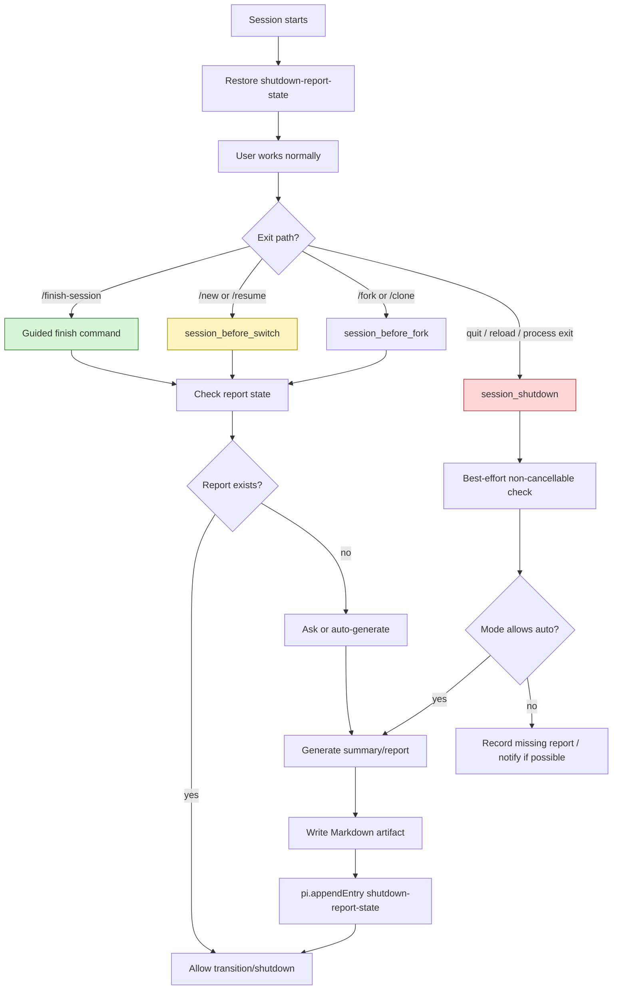

# Pi session shutdown summary/report extension: analysis, design, and implementation guide

## 1. Executive answer

Yes, Pi extensions can run hooks on session exit. Pi exposes a `session_shutdown` event that fires before an extension runtime is torn down. This makes it possible to do last-minute cleanup, persist state, export logs, or generate a summary/report before Pi exits or switches sessions.

However, there is an important design constraint:

> `session_shutdown` is a cleanup hook, not a cancellable “before quit” confirmation hook.

The event does not return `{ cancel: true }`. That means it can perform async work, but it is not the best place to ask a complex question that might need to cancel shutdown. For flows that must ask the user first, the safer design is to provide an explicit command such as `/finish-session`, `/exit-report`, or `/shutdown-report`, and have that command ask questions, generate reports, and only then call `ctx.shutdown()`.

So the best extension should have two layers:

1. **Explicit finish command path** — recommended user-facing path. It can ask the user, generate a summary/report, upload/export it, and then request shutdown.
2. **Passive shutdown hook path** — best-effort fallback. It runs on `session_shutdown` and can generate a minimal report automatically or record that a report was missing, but it should avoid blocking or surprising the user.

A robust extension can also intercept session replacement flows such as `/new` and `/resume` using `session_before_switch`, because that event is cancellable. It can ask, “This session has no report yet. Generate one before switching?” and cancel the switch if the user wants to stay.

## 2. What problem this extension solves

Long Pi sessions often produce useful work: implementation summaries, code reviews, design decisions, tickets, docmgr documents, Obsidian reports, or reMarkable bundles. At the end of a session, the human may forget to capture the final state.

A shutdown-report extension would help by detecting whether the current session has a durable end artifact, such as:

- a compact session summary;
- a Markdown project report;
- a docmgr document;
- an Obsidian vault note;
- a reMarkable upload bundle;
- a custom extension state entry saying “report generated”.

If no such artifact exists, the extension can prompt the user or create one automatically.

The target behavior is:

```text
User tries to finish session
        |
        v
Extension checks: has a report/summary already been generated?
        |
        +-- yes --> allow normal shutdown
        |
        +-- no --> ask user whether to generate one
                    |
                    +-- generate summary only
                    +-- generate project report markdown
                    +-- skip once
                    +-- disable for this session
```

## 3. Relevant Pi lifecycle events

### 3.1 `session_shutdown`

From Pi extension docs:

```typescript
pi.on("session_shutdown", async (event, ctx) => {
  // event.reason - "quit" | "reload" | "new" | "resume" | "fork"
  // event.targetSessionFile - destination session for session replacement flows
  // Cleanup, save state, etc.
});
```

This event fires before an extension runtime is torn down. It is useful for:

- saving state;
- closing resources;
- auto-committing;
- writing files;
- emitting final logs;
- best-effort report generation.

Example source:

```text
/home/manuel/.nvm/versions/node/v22.22.1/lib/node_modules/@mariozechner/pi-coding-agent/examples/extensions/auto-commit-on-exit.ts
```

That example uses `session_shutdown` to inspect Git status and auto-commit changes.

### 3.2 `session_before_switch`

```typescript
pi.on("session_before_switch", async (event, ctx) => {
  // event.reason - "new" or "resume"
  // event.targetSessionFile - destination for resume
  return { cancel: true };
});
```

This event is fired before `/new` or `/resume`. It can cancel. This is better than `session_shutdown` for asking the user whether to generate a report before switching away from a session.

### 3.3 `session_before_fork`

```typescript
pi.on("session_before_fork", async (event, ctx) => {
  // event.entryId
  // event.position
  return { cancel: true };
});
```

This event can also cancel. It is useful if forking/cloning should be gated by report generation, although it is probably less important than quit/new/resume.

### 3.4 Explicit shutdown commands

Pi extensions can request graceful shutdown with:

```typescript
ctx.shutdown();
```

Example source:

```text
/home/manuel/.nvm/versions/node/v22.22.1/lib/node_modules/@mariozechner/pi-coding-agent/examples/extensions/shutdown-command.ts
```

This is the best way to build a guided finish flow:

```text
/finish-session
  -> wait for idle
  -> check report state
  -> ask user what to generate
  -> generate report
  -> store report metadata
  -> ctx.shutdown()
```

## 4. Session data model

Pi sessions are JSONL files. Important persisted entry types include:

| Entry type | Purpose for this extension |
|---|---|
| `message` | Source conversation and tool results used to generate reports. |
| `compaction` | Existing compact summary, useful as input. |
| `custom` | Extension metadata such as “report generated at path X”. |
| `custom_message` | Optional context-visible summary/report marker. |
| `session_info` | Session display name, if set by compaction-title or `/name`. |

The extension should write durable metadata with:

```typescript
pi.appendEntry("shutdown-report-state", {
  generatedAt,
  reportPath,
  summaryPath,
  mode,
  sourceSessionFile,
});
```

That creates a `custom` entry. Custom entries do not participate in LLM context. They are ideal for extension bookkeeping.

On startup, restore state by scanning:

```typescript
for (const entry of ctx.sessionManager.getEntries()) {
  if (entry.type === "custom" && entry.customType === "shutdown-report-state") {
    state = { ...state, ...entry.data };
  }
}
```

## 5. Detecting whether a report exists

The extension needs a clear definition of “done”. Recommended markers:

1. **Extension metadata marker** — most reliable:
   - a `custom` entry with `customType: "shutdown-report-state"` and `generatedAt`.
2. **Report file exists** — reliable if path is stored:
   - `reportPath` exists on disk.
3. **Recent compaction exists** — useful but not enough:
   - compaction summaries preserve context, but they are not necessarily user-facing reports.
4. **Docmgr relation exists** — useful if integrating with docmgr:
   - report path is inside a ticket and related to the ticket.

Recommended state shape:

```typescript
interface ShutdownReportState {
  mode: "ask" | "auto-summary" | "auto-report" | "off";
  reportGenerated: boolean;
  generatedAt?: string;
  reportPath?: string;
  summaryPath?: string;
  lastPromptedAt?: string;
  skippedAt?: string;
  skipReason?: string;
}
```

## 6. Recommended user-facing modes

The extension should not surprise the user. It should support modes:

| Mode | Behavior |
|---|---|
| `ask` | Prompt before switch/finish if no report exists. Recommended default. |
| `auto-summary` | Generate a lightweight Markdown summary automatically on explicit finish or shutdown. |
| `auto-report` | Generate a fuller project report automatically. More expensive/slower. |
| `off` | Do nothing. |

Recommended commands:

| Command | Purpose |
|---|---|
| `/shutdown-report` | Show state and settings. |
| `/shutdown-report ask` | Enable prompt-before-finish behavior. |
| `/shutdown-report auto-summary` | Enable automatic lightweight summary. |
| `/shutdown-report auto-report` | Enable automatic full report. |
| `/shutdown-report off` | Disable. |
| `/shutdown-report-now` | Generate the report immediately. |
| `/finish-session` | Guided flow: generate if needed, then shutdown. |

## 7. Architecture



## 8. Important design constraint: prompting on exit

It is tempting to put this directly in `session_shutdown`:

```typescript
pi.on("session_shutdown", async (event, ctx) => {
  const ok = await ctx.ui.confirm("Generate report?", "No report exists. Generate one?");
});
```

This may work in some interactive cases, but it is not the best primary design because:

- `session_shutdown` cannot cancel shutdown;
- the UI may be in teardown mode;
- the event also fires for reloads, new sessions, resumes, and forks;
- blocking shutdown can feel surprising;
- there may be no UI in print/JSON/RPC mode.

Use `session_shutdown` for best-effort automatic work or cleanup. Use explicit commands and cancellable before-events for interactive decisions.

## 9. Report generation strategy

### 9.1 Lightweight summary

A lightweight summary can be generated locally from session entries without a model, or with a small model call.

Inputs:

- session name;
- current cwd;
- current branch entries;
- latest compaction summary if any;
- recent assistant messages;
- read/modified file lists from tool results or compaction details.

Output path suggestion:

```text
.pi/shutdown-reports/YYYY-MM-DDTHH-MM-SS-session-summary.md
```

### 9.2 Full project report

A full project report should use a model and produce a durable Markdown document. It can target:

- repo-local `.pi/shutdown-reports/`;
- docmgr ticket workspace, if the session is ticket-related;
- Obsidian vault, if configured;
- reMarkable upload, if requested.

For this extension, the first implementation should write repo-local Markdown and store the path in metadata. Docmgr/Obsidian/reMarkable can be added as integrations later.

### 9.3 Model prompt

Prompt skeleton:

```text
Create a shutdown report for this Pi coding session.

The report must help a future agent or human resume work.

Include:
- session title
- goal
- what changed
- important commands run
- important files read/modified
- design decisions
- unresolved issues
- validation status
- next steps

Write as Markdown.

Session name: ...
CWD: ...
Session file: ...
Existing compaction summary: ...
Serialized recent conversation: ...
```

## 10. Pseudocode

### 10.1 State restoration

```typescript
pi.on("session_start", async (_event, ctx) => {
  state = defaultState();
  for (const entry of ctx.sessionManager.getEntries()) {
    if (entry.type === "custom" && entry.customType === CUSTOM_TYPE) {
      Object.assign(state, entry.data ?? {});
    }
  }
  updateStatus(ctx);
});
```

### 10.2 Cancellable switch guard

```typescript
pi.on("session_before_switch", async (event, ctx) => {
  if (state.mode === "off") return;
  if (hasReport(state)) return;
  if (!ctx.hasUI) return;

  const choice = await ctx.ui.select("No shutdown report exists", [
    "Generate summary then continue",
    "Skip once",
    "Cancel switch",
  ]);

  if (choice === "Cancel switch") return { cancel: true };
  if (choice === "Skip once") {
    markSkipped();
    return;
  }

  await generateReport(ctx, "summary");
});
```

### 10.3 Explicit finish command

```typescript
pi.registerCommand("finish-session", {
  description: "Generate missing shutdown report, then exit Pi",
  handler: async (_args, ctx) => {
    await ctx.waitForIdle();

    if (!hasReport(state)) {
      const generated = await maybeAskAndGenerate(ctx);
      if (!generated && state.requireReport) return;
    }

    ctx.shutdown();
  },
});
```

### 10.4 Best-effort shutdown hook

```typescript
pi.on("session_shutdown", async (event, ctx) => {
  if (event.reason === "reload") return;
  if (state.mode === "off") return;
  if (hasReport(state)) return;

  if (state.mode === "auto-summary" || state.mode === "auto-report") {
    await generateReport(ctx, state.mode === "auto-report" ? "report" : "summary");
    return;
  }

  // In ask mode, do not block/cancel shutdown here.
  pi.appendEntry(CUSTOM_TYPE, {
    ...state,
    shutdownWithoutReportAt: new Date().toISOString(),
    shutdownReason: event.reason,
  });
});
```

## 11. File output design

Recommended repo-local output directory:

```text
.pi/shutdown-reports/
```

Filename pattern:

```text
YYYY-MM-DDTHH-MM-SS-<slugified-session-name>-report.md
```

Markdown shape:

```markdown
---
title: ...
session_file: ...
cwd: ...
generated_at: ...
generated_by: shutdown-report
---

# Session shutdown report: ...

## Goal

## Summary of work

## Files and artifacts

## Commands and validation

## Decisions

## Issues

## Next steps
```

## 12. Implementation phases

### Phase 1 — State and explicit command

Implement:

- `session_start` state restore;
- `/shutdown-report` state command;
- `/shutdown-report-now` writes a simple no-model Markdown report;
- `pi.appendEntry()` metadata.

### Phase 2 — Guided finish command

Implement:

- `/finish-session`;
- `ctx.waitForIdle()`;
- user prompt with `ctx.ui.select()`;
- `ctx.shutdown()` after generation.

### Phase 3 — Cancellable switch guard

Implement:

- `session_before_switch`;
- optional `session_before_fork`;
- cancel behavior when user chooses “Cancel”.

### Phase 4 — Model-generated full report

Implement:

- model call with `complete()`;
- conversation serialization;
- report prompt;
- robust fallback to no-model summary.

### Phase 5 — Integrations

Optional:

- docmgr ticket insertion;
- Obsidian project report output;
- reMarkable upload;
- auto-link from session summary widget.

## 13. Testing plan

### 13.1 Load test

```bash
pi --no-session --no-extensions -e ./extensions/shutdown-report --list-models no-such-model
```

Expected: exit 0.

### 13.2 Command test

In Pi:

```text
/shutdown-report
/shutdown-report-now
```

Expected:

- report file created under `.pi/shutdown-reports/`;
- metadata entry appended;
- status updated.

### 13.3 Finish command test

```text
/finish-session
```

Expected:

- asks if no report exists;
- writes report if selected;
- exits after completion.

### 13.4 Switch guard test

```text
/new
```

Expected:

- if no report exists and mode is `ask`, the extension asks first;
- choosing cancel prevents the session switch.

### 13.5 Session file inspection

```bash
rg 'shutdown-report-state|session_shutdown|shutdown report' ~/.pi/agent/sessions/--home-manuel-code-wesen-2026-04-21--pi-extensions--/*.jsonl
```

## 14. Risks and mitigations

| Risk | Mitigation |
|---|---|
| Shutdown hook blocks exit too long | Keep shutdown hook best-effort; prefer explicit `/finish-session`. |
| User gets prompted at surprising time | Prompt only on explicit command or cancellable before-events. |
| No UI available | Skip prompts and use configured auto/off behavior. |
| Report generation fails | Write minimal fallback report and record error in metadata. |
| Duplicate reports | Store `reportPath` and `generatedAt`; check before generating. |
| Reload triggers unwanted report | Ignore `event.reason === "reload"` by default. |

## 15. Answer to the original question

Can we add hooks on exit so that before exiting a session, Pi checks whether a summary/project report exists and asks whether to generate one?

Mostly yes, with nuance:

- **Yes**, `session_shutdown` can run async work before runtime teardown.
- **Yes**, explicit commands can ask the user and then call `ctx.shutdown()`.
- **Yes**, `session_before_switch` can ask and cancel `/new` or `/resume`.
- **No**, `session_shutdown` itself is not a cancellable before-exit hook, so it should not be the only mechanism for interactive report prompting.

The best product design is a hybrid:

1. `/finish-session` for deliberate report-and-exit.
2. `session_before_switch` for cancellable prompts before session replacement.
3. `session_shutdown` for best-effort auto-generation or metadata recording.
