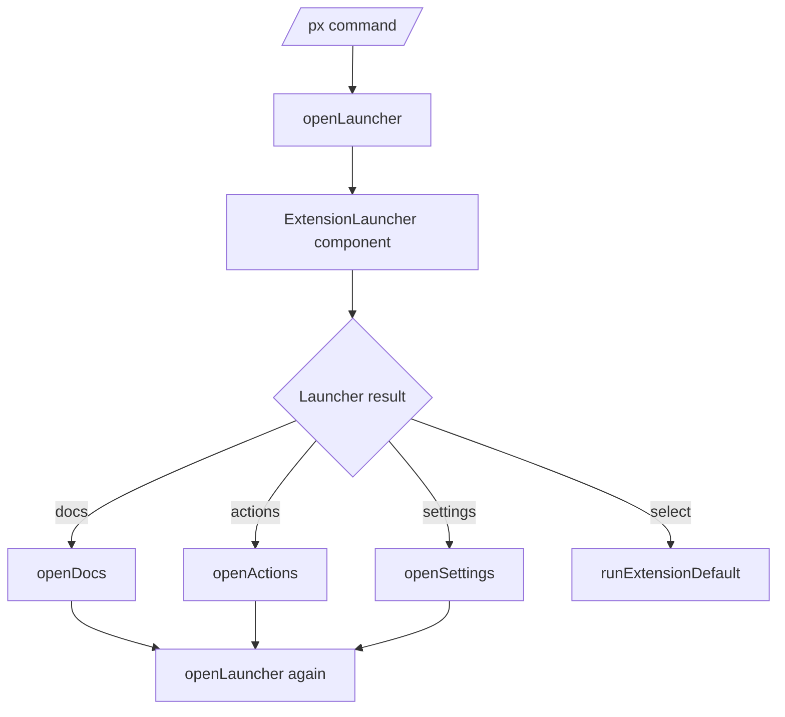

# Shared Extension UX Improvement Guide

## Executive Summary

This guide explains how the local Pi extension framework currently presents extensions and where the requested UX improvements should be implemented. The work is centered on the shared launcher (`/px`) and the shared modal components under `extensions/_shared/ui/`, with one prompto-specific integration point for inserting templates without relying on a leading slash command.

The recommended implementation has five parts:

1. Preserve launcher state when returning from docs, settings, or actions.
2. Make list navigation wrap at the top and bottom.
3. Replace ad-hoc substring/fuzzy scoring with a consistent chunk-based fuzzy matcher.
4. Add scroll state for the launcher details pane and make launcher/doc overlays taller based on terminal size.
5. Add a prompto keyboard shortcut and paste/insert behavior so templates can be opened from anywhere in the editor, not only by typing `/prompto` at the start.

The important design principle is that these are shared framework improvements, not one-off fixes in individual extensions. `ExtensionLauncher`, `ActionPicker`, `DocViewer`, and `Prompto` should end up with consistent keyboard behavior: `Esc` goes back, arrow keys navigate, wraparound is predictable in lists, fuzzy filtering removes non-matches, and longer panes can be scrolled without leaving the current context.

## Problem Statement

The current shared launcher is good enough for discovery, but it loses interaction context and wastes vertical space in ways that make keyboard-driven use slow. The user reports five concrete problems:

- Opening help/docs for an extension and pressing back returns to the top of the extension list instead of the previously selected extension.
- Pressing `Up` at the top of a list clamps at the first item instead of wrapping to the last item.
- `/` search should filter with fuzzy matching, not merely approximate matching that leaves too many unrelated entries visible.
- The top-level launcher details/help pane cannot be scrolled far enough to see all commands and metadata; the dialog should use more terminal height and support right-pane scrolling.
- Prompto should be invocable even when the editor is not at the beginning of a slash command, preferably through a shortcut or palette-style action that can insert/paste the expanded prompt.

These symptoms share one cause: the current overlays are small, stateful components, but their state is local and discarded when a nested overlay closes. The launcher uses fixed body heights, one scroll variable for the left list, and no scroll variable for the right details pane. The prompto command is registered as a normal slash command and currently writes expanded prompts with `setEditorText`, which replaces the editor instead of inserting into it.

## Current-State Architecture

### Extension registration model

Every extension registers a `PiExtensionRegistration` with shared metadata. The registry contract lives in `extensions/_shared/registry.ts` and defines the launcher-facing fields: `id`, `name`, `description`, `commands`, `tags`, `run`, `actions`, `docs`, `settings`, `widgets`, and `palette`. These fields are the data model consumed by the shared launcher and palette.

The important API shape is:

```ts
export interface PiExtensionRegistration {
  id: string;
  name: string;
  description: string;
  commands?: string[];
  tags?: string[];
  run?: PiExtensionActionHandler;
  actions?: PiExtensionAction[];
  docs?: PiExtensionDoc[];
  settings?: PiExtensionSettingsContribution;
  widgets?: PiDashboardWidget[];
  palette?: PaletteItem[];
}
```

Evidence: `extensions/_shared/registry.ts` defines the registration interfaces and `registerPiExtension()` / `listPiExtensions()` as the shared source of truth for launcher discovery.

### Launcher command flow

The launcher extension registers `/px` and opens `ExtensionLauncher`. When a user selects docs/actions/settings, `handleLauncherResult()` opens another overlay and then calls `openLauncher(ctx)` again.



Evidence:

- `extensions/launcher/index.ts:100-118` creates the `ExtensionLauncher` overlay.
- `extensions/launcher/index.ts:121-135` handles `docs`, `settings`, and `actions` by opening the nested overlay and then calling `openLauncher(ctx)` again.
- Because no launcher state is passed into the new `openLauncher(ctx)` call, the new launcher starts with `query = ""`, `cursor = 0`, and `scroll = 0` from the component constructor in `extensions/_shared/ui/extension-launcher.ts:45-48`.

### Launcher component state

`ExtensionLauncher` owns query and navigation state:

- `query` — current search string.
- `searchActive` — whether `/` search mode is active.
- `cursor` — selected extension index among visible extensions.
- `scroll` — left-list scroll offset.
- `cachedWidth` / `cachedLines` — render cache.

Evidence: `extensions/_shared/ui/extension-launcher.ts:40-50` declares those fields.

Input handling is modal. `/` enters search mode; `Esc` leaves search mode or cancels; `Enter`, `?`, `a`, `s`, `d`, and `p` run selected actions; arrow keys move selection.

Evidence: `extensions/_shared/ui/extension-launcher.ts:59-115` covers `Ctrl+C`, `Esc`, `/`, search-mode editing, `Enter`, docs, and actions.

### Fixed-height top-level layout

The launcher uses a fixed body height:

```ts
const bodyRows = 16;
```

It renders the body as a two-column split. The left column is scrollable through `this.scroll`; the right column is recomputed from `renderDetails()` and then truncated to `rows`.

Evidence:

- `extensions/_shared/ui/extension-launcher.ts:158-162` computes width and hard-codes `bodyRows = 16`.
- `extensions/_shared/ui/extension-launcher.ts:167-180` applies left-list scroll and renders the split body.
- `extensions/_shared/ui/extension-launcher.ts:260-275` joins left and right rows.
- `extensions/_shared/ui/extension-launcher.ts:302-345` builds detail lines and returns `lines.slice(0, rows)`, which prevents seeing commands/tags/registered id when the details overflow.

### Current search behavior

The launcher search code calls `scoreExtension()`. It first accepts simple substring matches, then checks whether every query character appears in order in one combined lowercased haystack.

Evidence:

- `extensions/_shared/ui/extension-launcher.ts:225-229` maps each extension to a score and filters `score >= 0`.
- `extensions/_shared/ui/extension-launcher.ts:391-405` implements the custom scoring logic.

This is not the same fuzzy behavior used by `@mariozechner/pi-tui`'s `fuzzyMatch` / `fuzzyFilter`. It also treats the entire query as one character stream. A query such as `prompt tem` may match through arbitrary characters across the combined haystack rather than treating `prompt` and `tem` as separate tokens that must each match meaningful metadata.

### Doc viewer behavior

`DocViewer` is a separate full-width modal with its own scroll state. It already handles `Up`, `Down`, `PageUp`, and `PageDown`, but it also uses a fixed `bodyRows = 18` and fixed width clamp.

Evidence:

- `extensions/_shared/ui/doc-viewer.ts:15-23` handles doc scroll input.
- `extensions/_shared/ui/doc-viewer.ts:25-38` computes `bodyRows = 18`, slices rendered markdown, and adds a scroll footer.
- `extensions/launcher/index.ts:171-182` opens docs with `maxHeight: "85%"`, but the component itself still renders exactly 18 body rows.

### Prompto behavior

Prompto is a registered extension and slash command. Its default action and command both call `runPrompto(pi, store, "", ctx)`. The prompto command exposes completions only for `/prompto ...` usage. When a template expands in editor-submit mode, it calls `ctx.ui.setEditorText(prompt)`.

Evidence:

- `extensions/prompto/index.ts:25-60` registers the prompto extension, action, docs, and palette item.
- `extensions/prompto/index.ts:62-80` registers the `/prompto` command and starts-with completions.
- `extensions/prompto/run.ts:51-55` sends auto-submit templates through `pi.sendUserMessage()` and editor-submit templates through `ctx.ui.setEditorText(prompt)`.

The Pi extension UI already exposes both `pasteToEditor()` and `getEditorText()` in addition to `setEditorText()`. The core interactive mode wires `pasteToEditor` to bracketed paste handling and `setEditorText` to full editor replacement.

Evidence:

- Pi core type definitions expose `pasteToEditor(text)`, `setEditorText(text)`, and `getEditorText()` in `/home/manuel/.nvm/versions/node/v22.22.1/lib/node_modules/@earendil-works/pi-coding-agent/dist/core/extensions/types.d.ts:128-132`.
- Runtime wiring maps `pasteToEditor` and `setEditorText` to different editor operations in `/home/manuel/.nvm/versions/node/v22.22.1/lib/node_modules/@earendil-works/pi-coding-agent/dist/modes/interactive/interactive-mode.js:1603-1606`.
- Pi also supports extension keyboard shortcuts via `registerShortcut()` in the type definitions at `/home/manuel/.nvm/versions/node/v22.22.1/lib/node_modules/@earendil-works/pi-coding-agent/dist/core/extensions/types.d.ts:844-848`, and runtime dispatch is wired in `/home/manuel/.nvm/versions/node/v22.22.1/lib/node_modules/@earendil-works/pi-coding-agent/dist/modes/interactive/interactive-mode.js:1312-1324`.

## Proposed Solution

### 1. Preserve launcher state across nested overlays

Add an explicit snapshot type to the shared launcher UI:

```ts
export interface ExtensionLauncherState {
  query: string;
  searchActive: boolean;
  cursor: number;
  listScroll: number;
  detailsScroll: number;
}
```

Add state to every result that leaves the launcher for a nested view:

```ts
export type ExtensionLauncherResult =
  | { kind: "select"; extension: PiExtensionRegistration; state: ExtensionLauncherState }
  | { kind: "actions"; extension: PiExtensionRegistration; state: ExtensionLauncherState }
  | { kind: "docs"; extension: PiExtensionRegistration; state: ExtensionLauncherState }
  | { kind: "settings"; extension: PiExtensionRegistration; state: ExtensionLauncherState }
  | { kind: "dashboard"; state: ExtensionLauncherState }
  | { kind: "palette"; state: ExtensionLauncherState }
  | { kind: "cancel" };
```

Then change `openLauncher()` to accept an optional initial state:

```ts
async function openLauncher(ctx: ExtensionCommandContext, initialState?: ExtensionLauncherState): Promise<void> {
  const result = await ctx.ui.custom<ExtensionLauncherResult>(
    (tui, theme, _keybindings, done) => new ExtensionLauncher({
      extensions,
      theme,
      done,
      initialState,
      requestRender: () => tui.requestRender(),
    }),
    { overlay: true, overlayOptions: { width: "90%", maxHeight: "90%", minWidth: 70, margin: 1 } },
  );
  await handleLauncherResult(result, ctx);
}
```

When returning from docs/actions/settings, pass the saved state back:

```ts
if (result.kind === "docs") {
  await openDocs(ctx, result.extension);
  return openLauncher(ctx, result.state);
}
```

This is preferable to global mutable state because the state is tied to one launcher session. It avoids surprises when another command opens `/px` later.

### 2. Wrap list navigation

Change launcher movement from clamping to modulo arithmetic:

```ts
private move(delta: number): void {
  const count = this.visibleExtensions().length;
  if (count === 0) return;
  this.cursor = (this.cursor + delta + count) % count;
  this.markDirty();
}
```

Apply the same pattern to `ActionPicker` and any shared picker where wraparound is expected. `Home` and `End` should remain absolute jumps. `PageUp` and `PageDown` should jump by visible rows and wrap only if the jump crosses the boundary; it is acceptable to clamp page jumps if the visual behavior is clearer.

The invariant is simple: arrow navigation in cyclic menus wraps; explicit positional navigation (`Home`/`End`) does not.

### 3. Replace launcher search with chunk-based fuzzy matching

Use `fuzzyMatch()` from `@mariozechner/pi-tui` rather than maintaining a custom scoring function. The search should split the query into tokens and require every token to match at least one metadata chunk. Chunks should be meaningful fields, not a single arbitrary haystack.

Recommended helper:

```ts
interface FuzzyResult<T> {
  item: T;
  score: number;
}

function filterExtensions(extensions: PiExtensionRegistration[], query: string): FuzzyResult<PiExtensionRegistration>[] {
  const tokens = query.trim().split(/[\s/]+/).filter(Boolean);
  if (tokens.length === 0) return extensions.map((item) => ({ item, score: 0 }));

  const results: FuzzyResult<PiExtensionRegistration>[] = [];
  for (const extension of extensions) {
    const chunks = extensionSearchChunks(extension);
    let totalScore = 0;
    let allTokensMatched = true;

    for (const token of tokens) {
      const best = chunks
        .map((chunk) => fuzzyMatch(token, chunk))
        .filter((match) => match.matches)
        .sort((a, b) => a.score - b.score)[0];

      if (!best) {
        allTokensMatched = false;
        break;
      }
      totalScore += best.score;
    }

    if (allTokensMatched) results.push({ item: extension, score: totalScore });
  }

  return results.sort((a, b) => a.score - b.score || a.item.name.localeCompare(b.item.name));
}
```

Recommended chunks:

```ts
function extensionSearchChunks(extension: PiExtensionRegistration): string[] {
  return [
    extension.id,
    extension.name,
    extension.description,
    ...(extension.commands ?? []),
    ...(extension.tags ?? []),
    ...(extension.actions ?? []).flatMap((a) => [a.id, a.title, a.description, ...(a.tags ?? [])]),
    ...(extension.docs ?? []).flatMap((d) => [d.id, d.title, d.description, ...(d.tags ?? [])]),
    ...(extension.palette ?? []).flatMap(flattenPaletteSearchChunks),
  ].filter((value): value is string => typeof value === "string" && value.length > 0);
}
```

This produces predictable behavior: typing `prompto` shows prompto; typing `prompt template` keeps extensions whose metadata actually includes fuzzy matches for both `prompt` and `template`; unrelated extensions disappear.

### 4. Add scroll state for the right details pane

The current `renderDetails()` truncates details with `lines.slice(0, rows)`. Instead, split detail rendering into two steps:

1. `buildDetailsLines(extension, width): string[]` returns all lines.
2. `renderDetails(extension, width, rows): string[]` applies `detailsScroll` and adds a footer hint when there is more content.

State:

```ts
private detailsScroll = 0;
```

Input handling:

```ts
if (matchesKey(data, Key.shift("up"))) return this.scrollDetails(-1);
if (matchesKey(data, Key.shift("down"))) return this.scrollDetails(1);
if (matchesKey(data, Key.shift("pageUp"))) return this.scrollDetails(-this.bodyRows());
if (matchesKey(data, Key.shift("pageDown"))) return this.scrollDetails(this.bodyRows());
```

Because terminal modifier support can vary, also support an ASCII fallback. A good fallback is `[` / `]` or `Alt+Up` / `Alt+Down` if those decode reliably in Pi's key handling. The footer should advertise both:

```text
Shift+↑↓ details · ↑↓ list · Enter run · ? docs · Esc close
```

Implementation detail: reset `detailsScroll = 0` whenever `cursor` changes or `query` changes. The selected extension's details are a different document; carrying a previous scroll offset into a different extension would be confusing.

Pseudocode:

```ts
private move(delta: number): void {
  const count = this.visibleExtensions().length;
  if (count === 0) return;
  this.cursor = (this.cursor + delta + count) % count;
  this.detailsScroll = 0;
  this.markDirty();
}

private scrollDetails(delta: number): void {
  this.detailsScroll = Math.max(0, this.detailsScroll + delta);
  this.markDirty();
}
```

During render, clamp to the actual detail height:

```ts
const allRightRows = this.buildDetailsLines(selected, rightWidth);
const maxScroll = Math.max(0, allRightRows.length - rows);
this.detailsScroll = Math.min(this.detailsScroll, maxScroll);
const rightRows = allRightRows.slice(this.detailsScroll, this.detailsScroll + rows);
```

### 5. Use more vertical space dynamically

The component render contract only receives width, not height. Overlay options can cap height, but the component must still decide how many rows to render. The pragmatic solution is to derive an approximate terminal height from `process.stdout.rows` and clamp it.

Recommended helper:

```ts
function terminalRows(fallback = 30): number {
  return typeof process.stdout.rows === "number" && process.stdout.rows > 0
    ? process.stdout.rows
    : fallback;
}

function launcherBodyRows(): number {
  // Chrome = top border + search + blank + help + split borders + footer(2) + bottom.
  const chromeRows = 9;
  return Math.max(16, Math.min(30, terminalRows() - chromeRows - 2));
}
```

Then replace `const bodyRows = 16` with `const bodyRows = launcherBodyRows()`. Increase `openLauncher()` overlay options to `maxHeight: "90%"` so Pi is allowed to display the taller component.

Apply the same pattern to `DocViewer`:

```ts
const bodyRows = Math.max(18, Math.min(40, terminalRows() - 4));
```

This change is intentionally local. It does not require changing the `Component.render(width)` contract. If Pi later extends render contexts with height, the helper can be replaced without changing caller semantics.

### 6. Add prompto shortcut and insertion behavior

Prompto should be reachable without needing a leading slash command. There are two complementary changes:

1. Register a keyboard shortcut in `extensions/prompto/index.ts`.
2. Add an insertion mode to `runPrompto()` so expanded templates can be pasted into the current editor instead of always replacing it.

Proposed public prompto runner options:

```ts
export interface RunPromptoOptions {
  output?: "replace-editor" | "paste-editor" | "send";
}

export async function runPrompto(
  pi: ExtensionAPI,
  store: PromptStore,
  args: string,
  ctx: ExtensionCommandContext,
  options: RunPromptoOptions = {},
): Promise<void> {
  // existing selection and expansion logic
  const output = options.output ?? (template.submit === "auto" ? "send" : "replace-editor");
  if (output === "send") pi.sendUserMessage(prompt, ctx.isIdle() ? undefined : { deliverAs: "followUp" });
  else if (output === "paste-editor") ctx.ui.pasteToEditor(prompt);
  else ctx.ui.setEditorText(prompt);
}
```

Then register a shortcut:

```ts
pi.registerShortcut("ctrl+shift+p", {
  description: "Prompto: pick and paste a prompt template",
  handler: async (ctx) => runPrompto(pi, store, "", ctx, { output: "paste-editor" }),
});
```

The exact keybinding should be chosen to avoid conflicts with the existing command palette (`Ctrl+Shift+Alt+N` according to the shared framework guide). Good candidates are:

- `ctrl+shift+o` — mnemonic: promptO, likely free.
- `ctrl+alt+p` — mnemonic: prompt, may conflict less than `ctrl+shift+p` in terminals.
- a configurable shortcut contribution if Pi settings are extended later.

The important behavior is `pasteToEditor()` rather than `setEditorText()`. `pasteToEditor()` preserves existing editor contents and uses Pi's paste handling, while `setEditorText()` replaces the editor entirely.

## Design Decisions

### Decision 1: Store launcher state as a snapshot, not a module-level singleton

**Context.** Returning from docs currently calls `openLauncher(ctx)` with no state, so the new component starts at the first extension.

**Options considered.** Store the last selection globally in the launcher extension, or add explicit state to `ExtensionLauncherResult` and thread it through `openLauncher()`.

**Decision.** Use explicit `ExtensionLauncherState` snapshots.

**Rationale.** Explicit state is testable, local to the interaction, and avoids surprising future launcher opens. A module-level singleton would make the next `/px` invocation inherit stale state from a previous workflow.

**Status.** Proposed.

### Decision 2: Use chunk-based fuzzy matching

**Context.** The custom `scoreExtension()` can match arbitrary character streams across a combined haystack.

**Options considered.** Keep and tune the custom scorer, use `fuzzyFilter()` on one combined string, or use `fuzzyMatch()` across meaningful chunks.

**Decision.** Use `fuzzyMatch()` across chunks and require every query token to match at least one chunk.

**Rationale.** Chunk matching produces intuitive filtering and prevents accidental matches through long concatenated strings. It also aligns with the prompto picker improvements.

**Status.** Proposed.

### Decision 3: Scroll details with modified arrows and fallback keys

**Context.** Plain arrow keys already navigate the left list. The right details pane needs independent scrolling.

**Options considered.** Move focus between panes with `Tab`, scroll details with shifted arrows, or always scroll both panes together.

**Decision.** Keep focus implicit and bind details scrolling to `Shift+Up/Down` plus a fallback.

**Rationale.** The launcher remains a single fast modal. Users do not need to understand focus state; the left list remains primary, and modified arrows scroll secondary detail content.

**Status.** Proposed.

### Decision 4: Use terminal row heuristics instead of changing the component contract

**Context.** Pi TUI components render with `render(width): string[]`, so components do not receive a height.

**Options considered.** Change Pi TUI's component contract, add height to shared UI option objects, or use `process.stdout.rows` locally.

**Decision.** Use a local `terminalRows()` helper for now.

**Rationale.** It solves the immediate problem without a cross-package API migration. If the Pi TUI contract changes later, this helper becomes the migration point.

**Status.** Proposed.

### Decision 5: Prompto insertion should paste, not replace

**Context.** `/prompto` currently expands into the editor with `setEditorText()`.

**Options considered.** Keep replacement behavior, append manually with `getEditorText()` and `setEditorText()`, or use `pasteToEditor()`.

**Decision.** Keep replacement as the default slash-command behavior for backward compatibility, but use `pasteToEditor()` for the new shortcut/palette insertion path.

**Rationale.** Paste preserves the editor content and follows core editor paste handling. It is also already exposed in the extension UI API.

**Status.** Proposed.

## Implementation Plan

### Phase 1: Launcher state restoration and wraparound

Files:

- `extensions/_shared/ui/extension-launcher.ts`
- `extensions/launcher/index.ts`

Steps:

1. Add `ExtensionLauncherState` and `snapshot()` method.
2. Add optional `initialState` to `ExtensionLauncherOptions`.
3. Hydrate `query`, `searchActive`, `cursor`, `scroll`, and `detailsScroll` from `initialState` in the constructor.
4. Include `state: this.snapshot()` on every non-cancel result.
5. Change `openLauncher(ctx)` to `openLauncher(ctx, initialState?)`.
6. Pass `result.state` when reopening after docs/actions/settings.
7. Change `move(delta)` to wrap around.
8. Add targeted tests or a manual smoke checklist.

Validation checklist:

- Open `/px`, move to Prompto, press `?`, press `Esc`, and confirm Prompto is still selected.
- Press `Up` at the first extension and confirm the selection wraps to the last extension.
- Press `Down` at the last extension and confirm it wraps to the first extension.

### Phase 2: Fuzzy search

Files:

- `extensions/_shared/ui/extension-launcher.ts`
- Optional shared helper: `extensions/_shared/ui/fuzzy.ts`

Steps:

1. Import `fuzzyMatch` from `@mariozechner/pi-tui`.
2. Replace `scoreExtension()` with chunk/token matching.
3. Include actions/docs/palette metadata in search chunks.
4. Sort by score ascending, then by extension name.
5. Reset `cursor`, `scroll`, and `detailsScroll` when query changes.

Validation checklist:

- `/` then `prompto` should show Prompto and hide unrelated extensions.
- `/` then `prompt template` should still show Prompto because the metadata contains both concepts.
- `/` then a nonsense query should show `No matching extensions`.

### Phase 3: Scrollable right details pane and dynamic height

Files:

- `extensions/_shared/ui/extension-launcher.ts`
- `extensions/_shared/ui/doc-viewer.ts`
- `extensions/launcher/index.ts`

Steps:

1. Add `detailsScroll` to launcher state.
2. Split detail rendering into `buildDetailsLines()` and `renderDetails()`.
3. Add `Shift+Up/Down`, `Shift+PageUp/PageDown`, and fallback keys for details scroll.
4. Add scroll footer text showing detail line range, e.g. `details 1-16/28`.
5. Add `terminalRows()` / `launcherBodyRows()` helpers.
6. Increase `openLauncher()` max height to `90%`.
7. Update `DocViewer` body row calculation from fixed `18` to a terminal-row clamp.

Validation checklist:

- Select an extension with many actions/docs/commands/tags.
- Confirm all detail sections can be reached using the right-pane scroll keys.
- Open launcher on a tall terminal and confirm it uses more than 16 body rows.
- Open docs for prompto and confirm more than 18 markdown rows are visible on a tall terminal.

### Phase 4: Prompto shortcut and paste insertion

Files:

- `extensions/prompto/index.ts`
- `extensions/prompto/run.ts`
- Optionally `extensions/prompto/README.md` or `extensions/prompto/docs/authoring.md`

Steps:

1. Add `RunPromptoOptions` with an `output` mode.
2. Keep current slash command behavior as replacement unless the user chooses a paste mode.
3. Add a prompto extension shortcut using `pi.registerShortcut()`.
4. Wire the shortcut to `runPrompto(..., { output: "paste-editor" })`.
5. Add a palette item or action labelled `Pick and paste template into editor` if the shortcut alone is not discoverable enough.
6. Update docs to explain replacement vs paste behavior.

Validation checklist:

- Type text into the editor, trigger the prompto shortcut, choose a template, and confirm the expanded prompt is inserted/pasted rather than replacing existing text.
- Run `/prompto` and confirm existing behavior still works.
- Confirm `submit: auto` templates still send messages rather than pasting unless explicitly forced by the shortcut design.

## API References

### `ExtensionLauncherOptions`

Current shape:

```ts
export interface ExtensionLauncherOptions {
  extensions: PiExtensionRegistration[];
  theme: { fg(color: string, text: string): string; bold(text: string): string };
  done(result: ExtensionLauncherResult): void;
  requestRender?: () => void;
}
```

Proposed addition:

```ts
initialState?: ExtensionLauncherState;
```

### `ExtensionCommandContext.ui`

Useful methods from Pi core:

```ts
ctx.ui.custom(...): Promise<T>;
ctx.ui.pasteToEditor(text: string): void;
ctx.ui.setEditorText(text: string): void;
ctx.ui.getEditorText(): string;
```

Use `pasteToEditor()` for prompto insertion. Use `setEditorText()` only when replacing the full editor is intended.

### `ExtensionAPI.registerShortcut()`

The Pi extension API supports keyboard shortcuts:

```ts
pi.registerShortcut(shortcut, {
  description: "...",
  handler: async (ctx) => { ... },
});
```

Use this for prompto's non-slash invocation path.

## Risks and Review Notes

- **Terminal modifier support.** `Shift+Arrow` may not decode consistently in every terminal. Provide fallback keys and test in the actual terminal used with Pi.
- **State object drift.** If new launcher state fields are added later, update `snapshot()` and constructor hydration together.
- **Fuzzy search overmatching.** Including too many long chunks can weaken filtering. Do not include absolute file paths in launcher search unless there is a clear user-facing need.
- **Prompto paste semantics.** Pasting a very large prompt may trigger editor paste compaction/collapse behavior. That is acceptable, but the docs should mention it.
- **Shortcut conflicts.** Check existing registered shortcuts and terminal-reserved chords before choosing the final prompto shortcut.

## Intern Onboarding Checklist

Read these files in order:

1. `extensions/_shared/registry.ts` — data model for registered extensions.
2. `extensions/launcher/index.ts` — command flow from `/px` into shared overlays.
3. `extensions/_shared/ui/extension-launcher.ts` — main launcher component, state, filtering, rendering, and keyboard handling.
4. `extensions/_shared/ui/doc-viewer.ts` — docs overlay and scroll behavior.
5. `extensions/_shared/ui/action-picker.ts` — smaller list/detail picker with similar keyboard patterns.
6. `extensions/prompto/index.ts` — prompto extension registration and command/action/palette wiring.
7. `extensions/prompto/run.ts` — prompto expansion output path.
8. `/home/manuel/.nvm/versions/node/v22.22.1/lib/node_modules/@earendil-works/pi-coding-agent/dist/core/extensions/types.d.ts` — extension API methods available to local extensions.

Run these validation commands after implementation:

```bash
timeout 20 pi --list-models
```

Then manually test in Pi:

```text
/reload
/px
/prompto
```

Manual checks should cover search, wraparound, docs back behavior, details scrolling, doc scrolling, prompto shortcut insertion, and unchanged `/prompto` replacement behavior.

## References

- `extensions/_shared/ui/extension-launcher.ts:40-50` — current launcher state fields.
- `extensions/_shared/ui/extension-launcher.ts:59-115` — current input model.
- `extensions/_shared/ui/extension-launcher.ts:158-162` — fixed launcher body height.
- `extensions/_shared/ui/extension-launcher.ts:203-207` — clamped movement.
- `extensions/_shared/ui/extension-launcher.ts:225-229` and `391-405` — current custom search scoring.
- `extensions/_shared/ui/extension-launcher.ts:302-345` — details pane construction and truncation.
- `extensions/launcher/index.ts:121-135` — nested overlay returns reopen launcher without preserving state.
- `extensions/_shared/ui/doc-viewer.ts:15-38` — doc scroll input and fixed body height.
- `extensions/prompto/index.ts:25-80` — prompto extension and slash-command registration.
- `extensions/prompto/run.ts:51-55` — prompto output behavior.
- Pi core extension API type definitions: `/home/manuel/.nvm/versions/node/v22.22.1/lib/node_modules/@earendil-works/pi-coding-agent/dist/core/extensions/types.d.ts:128-132`, `844-848`.
